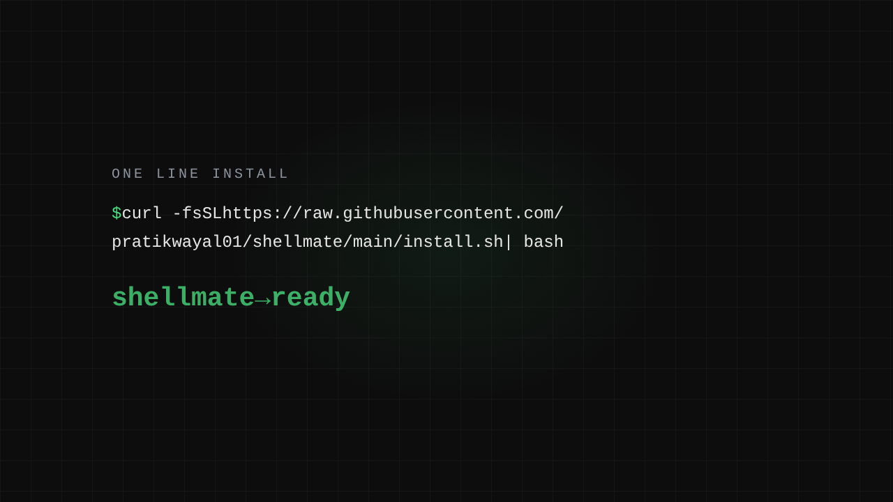

# shellmate — linux commands in human words

> Type what you mean, get the exact command.  
> Instant for known commands, local LLM for the rest. No cloud, no API key.

**Repository:** [pratikwayal01/shellmate](https://github.com/pratikwayal01/shellmate)



<video src="assets/brag.mp4" controls loop muted width="640"></video>

---

## Install

**Linux / macOS**
```bash
curl -fsSL https://raw.githubusercontent.com/pratikwayal01/shellmate/main/install.sh | bash
```

That's it. Installs to `~/.local/bin/shellmate` and verifies the checksum.

**Windows** — grab `shellmate-windows-x86_64.exe` from the [latest release](https://github.com/pratikwayal01/shellmate/releases/latest).

**From source** (any OS with Python)
```bash
git clone git@github.com:pratikwayal01/shellmate.git && cd shellmate
./install.sh   # ~/.local/bin/shellmate + builds tldr index
```

---

## Usage

```
shellmate            # interactive: type a question in plain words
```

```
$ shellmate
>>> show disk space
[map] df -h
>>> kill process on port 8080
[map] fuser -k 8080/tcp
>>> hello
[tldr] hello
>>> compress a folder with tar and show progress
[model] tar -czf archive.tar.gz -C folder .
```

### REPL commands

```
/remember <phrase> :: <command>   Remember a custom command
/clear                            Clear history
/update                           Install the latest release
/help                             List commands
/quit                             Exit
```

When a `[map]` or `[tldr]` answer has no placeholders and no destructive patterns, shellmate asks `run? [y/N]` and executes it (interactive mode only). Type `run it` to re-offer the last suggested command — including `[model]` answers, which stay display-only until you ask. Model/tldr answers are stripped of markdown and refused if they carry shell metacharacters (`; & $`).

Auto-update: once a day shellmate checks GitHub for a newer release and prints a notice when one exists; `/update` installs it (checksum-verified, see below).

### One-shot

```bash
echo "flush dns cache on arch" | shellmate   # resolvectl flush-caches
```

---

## How it works

Three tiers, first hit wins:

| Tier | Source | Latency |
|---|---|---|
| 1. Map | Curated keyword map (`commands.json`) | instant |
| 2. tldr | ~6700-page tldr index (FTS5) | instant |
| 3. Model | Spark-X2.5-1.7B locally via llama.cpp | ~1-2s |

Each answer is prefixed with its tier: `[map]` / `[tldr]` / `[model]`.

The model tier needs a local llama-server on port 11434:

```bash
llama-server -m ~/models/Spark-X2.5-1.7B-Q4_K_M.gguf -c 2048 --port 11434 \
  --host 127.0.0.1 --reasoning off --repeat-penalty 1.4 --repeat-last-n 128 \
  --load-mode mlock --threads 16
```

Without the server, map and tldr tiers still work — model queries print a start hint.

- **No analytics, no telemetry, no network calls** (except the local model server)
- Map + tldr tiers need zero dependencies — binary install only
- Your custom commands live in `~/.shellmate/commands.local.json`

---

## Extending the map

Edit `commands.json` — `kw` = phrases a user might type, `cmd` = the exact shell line, `desc` = one line. Per-user commands in `~/.shellmate/commands.local.json` (same format) win over the repo map.

Coverage grows by gap: when the model fumbles a query, that command earns a map entry.

---

## Uninstall

```bash
curl -fsSL https://raw.githubusercontent.com/pratikwayal01/shellmate/main/install.sh | bash -s -- uninstall
```

Removes the binary, the tldr index (`~/.cache/shellmate/`), and your custom commands (`~/.shellmate/`).

## Self-update

```bash
curl -fsSL https://raw.githubusercontent.com/pratikwayal01/shellmate/main/install.sh | bash
```

Re-downloads the latest release (checksum-verified). The existing tldr index is kept.
Or run `/update` inside shellmate — same thing.

---

*MIT licensed.*